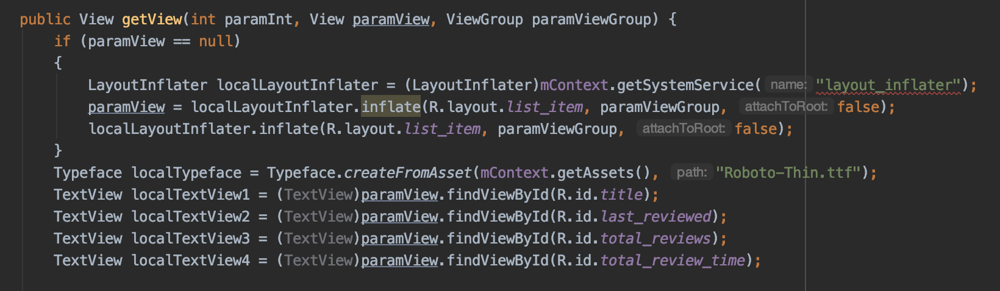
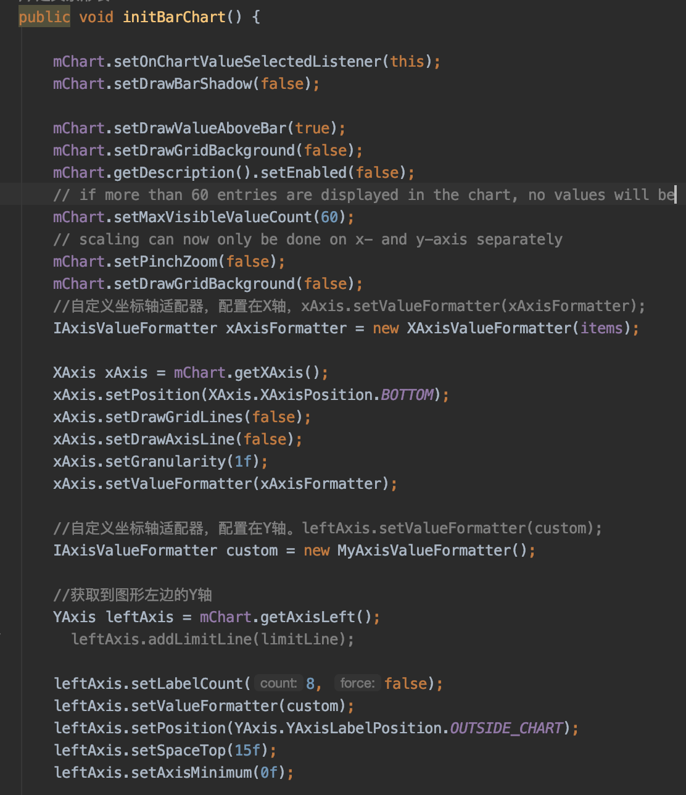
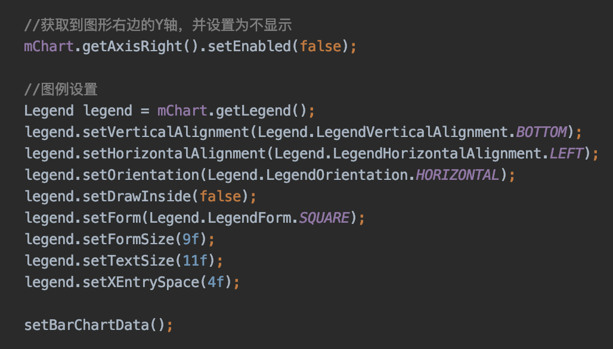
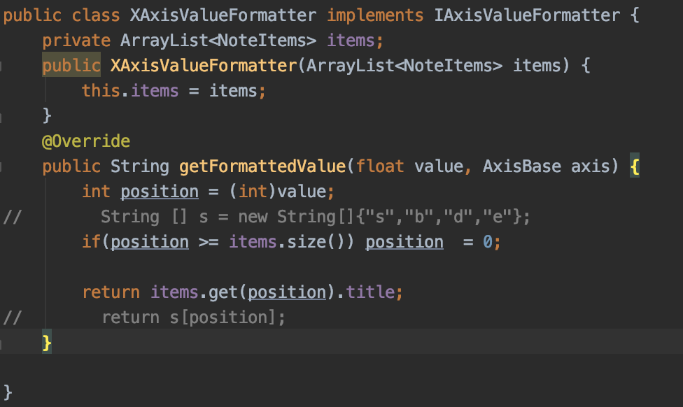
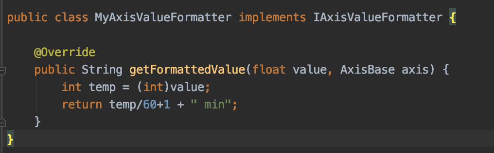
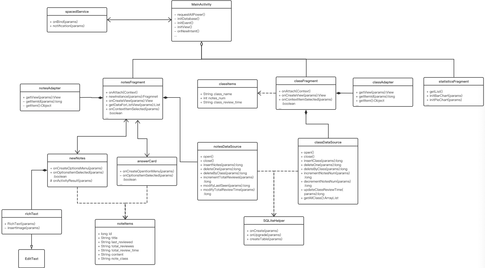

# 记忆助手

## 成员信息

李赛尉 17343062

李秀祥 17343065

陆俞因 17343081

## 简介

（介绍APP的背景，动机等）

学习是一个“学习新知识”加上“温故知新”的过程，对于信息时代学业繁重的大学生而言，我们需要一个便携、智能的“记忆助手”，帮助我们分门别类地记录知识点，在手机上实现随时随地记忆复习；我们需要一个“监督者”或称“记忆教练”，根据复习的间隔时间自动提示我们应该温习某一知识了；我们需要一个“记忆指导”，自动记录和统计我们的复习情况(如复习某一类别(学科)的总时长)，并且提供可视化的图表，帮助我们总结先前的复习状态并且科学地调整接下来的复习计划。

## 开发环境

- **操作系统**：Windows/Mac OS
- **IDE**：Android Studio

*为了避免您在Github上看不到图片，请在/etc/hosts中加入：199.232.28.133 raw.githubusercontent.com*

## 成员分工

（介绍成员分工情况）

- **李赛尉**：负责note添加、详情页面和通知机制功能实现。
- **李秀祥**：负责class相关内容、统计图表的添加及更新。
- **陆俞因**：负责 Tab 选项卡、类别页的 UI 设计和实现，包括类别相关数据库接口的实现。


## 功能信息

（确定APP的所需要实现的功能，此内容将作为检查APP是否功能完善的重要依据）

1. 实现 Tab 选项卡，点击 Tab 切换到对应页面(笔记页、类别页、统计页)；
2. 实现增、删、显示类别和笔记：
   1. 点击 `ActionBar` 的 `+` 按键添加新类别或新笔记；
   2. 长按某类别或某笔记时，弹出删除窗口。删除某类别的同时删除该类别的所有笔记，删除某笔记时更新该类别的笔记数；
   3. 选中某类别时，显示该类别的所有笔记；
   4. 选中某笔记时，显示该笔记的详情页面；
3. 实现自动提示用户复习笔记。在经过一定时间后，按照最近一次复习时间排序，依次提示用户复习，点击提示信息，跳转进入该笔记的详情页面；
4. 实现用户复习笔记情况统计，提供用户友好的统计数据可视化。辅助用户掌握自己的复习情况，并科学地安排接下来的复习计划：
   1. 在选中某笔记时，进入复习状态，及时更新笔记的最近一次复习时间为当前系统时刻；
   2. 退出笔记的详情页面时，退出复习状态，更新笔记的复习总时长，同时更新该笔记所属类别的复习总时长；
   3. 统计页显示统计数据图表。


## 重点&难点

（介绍APP实现中的重点、难点等内容）

### 1. Fragment 间通信

由于我们的应用使用 `FrameLayout` 和 `Fragment` 实现 Tab 选项卡，需要进行 `Fragment` 与 `Activity` 之间、`Fragment` 之间的通信。我们通过 `Bundle` 与回调函数两种方式实现通信。

#### Bundle

实现 `Activity` 到 `Fragment` 的通信，基本步骤如下：

1. 实现 `Fragment` 的实例化方法，生成 `Bundle`。接着调用函数`putString(String, String)`将要传递的信息加入bundle中。

```java
// Fragment
public static NotesFragment newInstance(String note_class) {
    NotesFragment notes_frag = new NotesFragment();
    Bundle bundle = new Bundle();
    bundle.putString("note_class",note_class);
    notes_frag.setArguments(bundle);
    return notes_frag;
}

```

2. 在 `Activity` 中调用 `Fragment` 的实例化方法，以传入参数的形式实现通信；

```java
// MainActivity
notes_frag = NotesFragment.newInstance(selected_class);
```

3. 在 `Fragment` 的 `onCreateView` 生命周期解析 `Bundle` 获取通信信息；

```java
// Fragment
public View onCreateView(LayoutInflater inflater, ViewGroup container, Bundle savedInstanceState) {
    ...
	Bundle bundle = getArguments();
    notes_class = bundle.getString("note_class");
    ...
}
```

 #### 回调函数

实现 `Fragment` 到 `Activity` 的通信，基本步骤如下：

1. `Fragment` 声明回调接口；

   ```java
   // Fragment
   public interface toActivityListener {
       void deleteNotesInform(String del_note_class);
   }
   ```

2. `Activity` 实现回调接口；

   ```java
   // Activity
   @Override
   public void deleteNotesInform(String del_note_class) {
       ...
   }
   ```

3. `Fragment` 调用回调函数实现到 `Activity` 的通信。

   ```java
   // Fragment
   myToActivityListener.deleteNotesInform(notes_class);
   ```

   

### 2. SQLite 数据库操作

我们的应用涉及较多的数据库操作，包括表内以及跨表的 CRUD (增删改查)，我们通过封装数据库操作相关接口(`persistence/NotesDataSource.java` 和 `persistence/ClassDataSource.java`)简化设计和实现，降低程序的耦合度。

首先通过继承`SQLiteOpenHelper`来对数据库的增删改查进行封装。这里以开表为例：

```java
    public void onCreate(SQLiteDatabase database) {
        database.execSQL(" CREATE TABLE " + TABLE_NOTES + " (" +
                COLUMN_ID + " INTEGER PRIMARY KEY AUTOINCREMENT, " +
                COLUMN_TITLE + " TEXT NOT NULL, " +
                COLUMN_LAST_REVIEWED + " TEXT NOT NULL, " +
                COLUMN_TOTAL_REVIEWS + " INT NOT NULL, " +
                COLUMN_TOTAL_REVIEW_TIME + " TEXT NOT NULL, " +
                COLUMN_CONTENT + " TEXT NOT NULL, " +
                COLUMN_NOTE_CLASS + " TEXT NOT NULL);"
        );
     }
```

通过这一步封装，就可以直接创建出来属于note和class的数据库接口了。然后就开始封装具体某个元素的数据库接口。以note的增加数据为例：先写好相应的的sql语句，然后再使用上面封装好的`SQLiteHelper`进行操作。

```java
    public long incrementTotalReviews(long id)
    {
        this.open();	//访问数据库
        String sql = "UPDATE " + SQLiteHelper.TABLE_NOTES +
                " SET " + SQLiteHelper.COLUMN_TOTAL_REVIEWS + "=" + SQLiteHelper.COLUMN_TOTAL_REVIEWS + "+1" +
                " WHERE " + SQLiteHelper.COLUMN_ID + " = " + id;

        database.execSQL(sql);	//数据库执行查询语句
        this.close();	//关闭访问数据库
        return 0;

    }
```

在数据显示，我们使用了 `<ListView>` 和 `Adapter`，通过 `BaseAdapter` 更新 UI 的数据显示。



### 3.图文本添加以及显示

对于note添加支持文字图片，同时实时显示于EditView中；而详情页显示则通过TextView实现。

#### 图文本添加

首先通过系统MediaStore来提供相册上传图片内容:

```java
//相册上传
Intent i = new Intent(
        Intent.ACTION_PICK,
        android.provider.MediaStore.Images.Media.EXTERNAL_CONTENT_URI);
startActivityForResult(i, RESULT_LOAD_IMAGE);
```

然后对于`onActivityResult`进行重写，将传入的图片Uri进行读取并且取得其图片地址:

```java
Uri selectedImage = data.getData();

String[] filePathColumn = {MediaStore.Images.Media.DATA};

//通过Cursor读取图片对应本地地址
Cursor cursor = getContentResolver().query(selectedImage,
        filePathColumn, null, null, null);
cursor.moveToFirst();

int columnIndex = cursor.getColumnIndex(filePathColumn[0]);
imagePath = cursor.getString(columnIndex);
cursor.close();
//向RichText中插入图片
content.insertImage(imagePath);
```

而对于`RichText`则是通过继承`EditText`，其中`insertImage`函数为了把图片插入到RichText中。

```java
//为了后续显示将图片地址转为html标签
String htmlLabel = "";
final SpannableString s = new SpannableString(htmlLabel);

Drawable img = Drawable.createFromPath(imagePath);
img.setBounds(0,0,img.getIntrinsicWidth(),img.getIntrinsicHeight());
//设置图片的Span并且加入到内容中
ImageSpan span = new ImageSpan(img, ImageSpan.ALIGN_BASELINE);
s.setSpan(span,0,htmlLabel.length(), Spannable.SPAN_INCLUSIVE_EXCLUSIVE);
append(s);
```

#### 图文本显示

对于在TextView中显示则通过创建一个`ImageGetter`并且重写其中`getDrawable`函数即可:

```java
@Override
public Drawable getDrawable(String source) {
    Drawable d = null;
    try {
        if(source.length() == 1){
          	//文本
            int id = Integer.parseInt(source);
            d = getResources().getDrawable(id);
        }
        else{
          	//图片
            d = Drawable.createFromPath(source);
            d.setBounds(0,0,d.getIntrinsicWidth(),d.getIntrinsicHeight());
        }

    } catch (Exception e) {
        e.printStackTrace();
    }
    return d;
}
```

当然需要注意的是要把原先的换行符`"\n"`换成`<br>`才行，不然不会识别。

### 4.通知功能

通过在`SpacedService`中通过`handler`的`postDelayed`来实现定时提示，而具体的时间分布则通过`notificationRequired`函数来进行，根据已提醒次数和一定时间间隔来控制是否加入提醒队列`items`，然后对于其队列中note进行提醒记忆，同时更新对应数据库中通知次数字段。每分钟会进行一次检查有无通知并进行发送。

```java
handler.postDelayed(new Runnable() {
    public void run() {
        NotesDataSource nds = new NotesDataSource(SpacedService.this);
        List<NoteItems> items = nds.getAllNotesForNotification();
        for(NoteItems item : items)
        {
            SpacedService.this.notification(item.id,
                                            item.title,
                                            item.content,
                                            item.note_class);
            nds.incrementTotalReviews(item.id);
        }
        handler.postDelayed(this, 60000);//每分钟检测一次
    }
}, 60000);
```

而关于通知的建立，对于API版本高于26的，先对于`NotificationChannel`进行设置，然后在`notificationManager`中对于其渠道进行创建，然后对于通知`notification`的创建以及绑定对应渠道id来进行显示通知：

```java
NotificationChannel mChannel = new NotificationChannel(id, name, NotificationManager.IMPORTANCE_LOW);
notificationManager.createNotificationChannel(mChannel);
notification = new Notification.Builder(this)
        .setChannelId(id)
        .setContentTitle("有内容需要记忆！")
        .setContentText("题目为 " + title)
        .setContentIntent(i)
        .setWhen(System.currentTimeMillis())
        .setSmallIcon(R.mipmap.ic_launcher_round).build();
```

而对于低于API26版本的则直接通过`NotificationCompat.Builder`进行创建即可。


### 5.统计图表

本模块主要用于统计每个class的note内容，以及每次为note工作所花费的时间。主要有两个表格：条形图和饼图。主要的工具为：MPAndroidChart

#### 准备工作

*该工具并非本地自带库，所以需要进行稍微的设置*

1. 在项目目录下，修改`build.gradle`引入maven链接：

   ```
   allprojects {
       repositories {
           google()
           jcenter()
           maven { url 'https://jitpack.io' }	//加入部分
       }
   }
   ```

2. 在app目录下，修改`build.gradle`因为相关依赖：

   ```
   dependencies {
       implementation 'com.github.PhilJay:MPAndroidChart:v3.0.3'
   }
   ```

#### 具体实现

以条形图为例：





以上部分为表格约束函数，包括：最大横坐标数目、横坐标单位、是否显示背景表格等内容。

接下来就是关于表格数据的添加，数据已经存放在了`ArrayList<NoteItem> item`中，所以需要通过遍历将其包含的复习时间取出来，当作表格数据：

```java
        ArrayList<BarEntry> yVals1 = new ArrayList<>();

        int i = 0;

        for(NoteItems it : items) {
            yVals1.add(new BarEntry(i, Float.valueOf(it.total_review_time).floatValue()));
            i++;
        }
```

数据已经获得。后续将数据转化为条形图可用的`DataSet`：

```java
            set1 = new BarDataSet(yVals1, "class:"+items.get(0).note_class);
            set1.setDrawIcons(false);

            ArrayList<IBarDataSet> dataSets = new ArrayList<>();
            dataSets.add(set1);

            BarData data = new BarData(dataSets);
            data.setValueTextSize(10f);

            data.setBarWidth(0.9f);

            mChart.setData(data);
```

#### 横、纵坐标的自定义实现：

- 横坐标，默认的为数字，这里需要改成每个note的title。所以我们需要重写该类：

  

- 纵坐标，需要加上单位

  

#### 数据的及时修改

为了能够在选择class、对数据删除或者增加后，表格的数据能够及时修改，我们需要在`MainActivity`中加入部分内容。内容具体在每个`NoteFragment`修改之后，这样就可以实现同步的变化。

```java
    public void readdClassFrag() {
        // get transaction
        FragmentManager fm = getSupportFragmentManager();
        // begin transaction
        ftr = fm.beginTransaction();
        hideTransaction(ftr);
        if(class_frag != null) {
            ftr.remove(class_frag);
        }
        class_frag = new ClassFragment();
        ftr.add(R.id.tab_frame, class_frag);
        ftr.commit();
    }
```


## 实现方法

（下面内容属于第三次考核，依个人写作习惯和项目情况，自己组织语言和结构。需要包括**需求分析（用例图），设计（类图，流程图）等**，完整展示APP的实现方法。此内容将作为提问环节的重要依据。）

### 设计的UML类图




### 项目的主要模块介绍

#### 1. MainActivity.java

主页面代码，对应主布局 `tab_layout.xml`。通过 `FrameLayout`+`Fragment` 实现 Tab 选项卡，控制笔记页、类别页、统计页间的切换，并实现各个子页间的间接通信，同时控制 `ActionBar` 的按键事件。主要功能包括：

- `onCreate(Bundle)`: 初始化数据库、主视图、Tab 按键事件，动态获取权限；
- `onClick(View)` && `setSelected(int)`: 实现 `View.OnClickListener` 接口的 `onClick(View)` 方法，实现了点击 Tab 按键，切换到相应的页面，具体来说，是将对应页面的 `fragment` 填充到主布局 `tab_layout.xml` 的 `<FrameLayout>` 中；
- `onOptionsItemSelected(MenuItem)`: 控制 `ActionBar` 的按键事件，
  1. 点击 `+` 按键，若当前处于笔记页，则发送 `Intent` 启动 `NewNotes` 页面新增笔记；若当前处于类别页，则调用 `newClassDialog()` 方法新增类别。
  2. 点击 `about` 按键，弹出应用说明。

- `onCreateContextMenu(...)` && `onCreateOptionsMenu(Menu)`: 创建笔记页和类别页用到的上下文菜单；
- `deleteNotesInform(String)`: 实现了笔记页的回调函数，接收笔记页删除笔记的信息，并更新类别页的显示；
- `setSelectedClass(String)`: 实现了类别页的回调函数，取得用户点击选中的类别，并重设笔记页的显示，即在笔记页显示选中类的所有笔记。

#### 2.ClassFragment.java

类别页面代码，对应类别页布局 `class_layout.xml` 以及类别项布局 `class_item.xml`。主要功能包括：

- `onCreateView(...)`: 初始化类别页的 UI，并设置 `<ListView>` 组件的 `Adapter`；
- `interface ClasstoActivityListener`: `ClassFragment` 向 `MainActivity` 通信的回调接口；
- `onContextItemSelected(MenuItem)`: 设置了类别页中上下文菜单删除键的点击事件，实现删除类别(同时删除该类别的所有笔记)。

#### 3.NotesFragment.java

笔记主页面代码，对应笔记页布局 `activity_notes.xml` 以及笔记项布局 `list_items.xml`。主要功能包括：

- `newInstance(String)`: `NotesFragment` 的实例化方法，参数为当前选中的类别名。通过 `Bundle` 实现 `NotesFragment` 与 `MainActivity` 间的通信，从 `MainActivity` 取得当前选中的类别名；
- `onCreateView(...)`: 初始化类别页的 UI，并设置 `<ListView>` 组件的 `Adapter`，同时设置笔记项的点击事件，点击笔记项启动详情页 `AnswerCard` 显示选中笔记的内容；
- `interface toActivityListener`: `NotesFragment` 向 `MainActivity` 通信的回调接口；
- `onContextItemSelected(MenuItem)`: 设置了笔记页中上下文菜单删除键的点击事件，实现删除笔记，并调用回调函数通知 `MainActivity` 同时更新类别页的显示。

#### 4.Persistence

持久层，定义了数据库的数据结构并封装了数据库的接口。

#### 5.Data Structure

类别的数据结构，对应 `ClassItems.java`。

| attribute            | data type | description        |
| -------------------- | --------- | ------------------ |
| _id(**primary key**) | int       | 类别的唯一 id      |
| class_name           | String    | 类别名             |
| notes_num            | int       | 类别包含的笔记总数 |
| class_order          | int       | 类别的排序         |
| class_review_time    | String    | 复习该类别的总时长 |


笔记的数据结构，对应 `NoteItems.java`。

| attribute            | data type | description              |
| -------------------- | --------- | ------------------------ |
| _id(**primary key**) | int       | 笔记的唯一 id            |
| title                | String    | 笔记标题                 |
| last_reviewed        | String    | 最近一次复习该笔记的时间 |
| total_reviews        | int       | 复习该笔记的总次数       |
| content              | String    | 笔记内容                 |
| note_class           | String    | 笔记所属类别名           |
| total_review_time    | String    | 复习该笔记的总时长       |

**两个表的公共表头为：note_class = class_name。**这样就可以知道了class的名字，就可以查询出对应class下的所有note内容。

#### 6.SQLiteHelper.java

通过实现`SQLiterOpenHelper`，创建和更新 SQLite 数据库，创建类别表和笔记表。

- `onCreate(SQLiteDatabase)`：创建数据库中的表
- `onUpgrade(SQLiteDatabase db, int oldVersion, int newVersion)`：更新表格中的数据

#### 7.ClassDataSource.java

实现操作类别表的接口。主要功能包括：

- `insertClass(String)`: 增加类别；
- `deleteOne(String)`: 删除类别；
- `incrementNotesNum(String)`: 增加笔记时，该类别的笔记总数(`notes_num`) 加一；
- `decrementNotesNum(String)`: 删除笔记时，该类别的笔记总数(`notes_num`) 减一；
- `updateClassReviewTime(long, String)`: 复习笔记时，更新该类别的复习总时长；
- `getAllClass()`: 取得所有类别的数据。

#### 8.NotesDataSource.java

实现操作笔记表的接口。主要功能包括：

- `insertNotes(...)` : 增加笔记；
- `deleteOne(String, String)`: 删除一条笔记；
- `deleteByClass(String)`: 删除某类别的所有笔记；
- `incrementTotalReviews(String)`: 复习某笔记时，该笔记的复习次数(`total_reviews`)加一；
- `modifyLastSeen(String)`: 复习某笔记时，更新该笔记的最近复习时间(`last_reviewed`)；
- `modifyTotalReviewTime(String)`: 结束复习某笔记时，更新该笔记的总复习时长(`total_review_time`)；
- `getAllNotes()`: 取得所有笔记数据；
- `getNotesOfClass(String)`: 取得某类别的所有笔记数据；
- `getAllNotesForNotification()`: 取得所有需要复习的笔记。

#### 9.AnswerCard.java

实现对于note详情页面的显示。相关函数包括：

- `onCreate(Bundle)`:设置标题背景，同时通过Intent接受从notesFragment传来的笔记title、context等信息。之后通过重写`ImageGetter`函数对于context的文字以及图片进行转化设置到textView上。同时设定其`AppTagHandler`来为之后点击图片效果做准备。
- `onCreateOptionsMenu(Menu)`:创建appbar上菜单项。
- `onOptionsItemSelected(MenuItem)`:菜单点击事件处理。
- `onStop()`:重写`onStop`方法，为了实现对于进入详情对于note累计复习时间的确定，并在退出时更新对应数据库项。

#### 10.AppTagHandler.java

继承于Html.TagHandler，为了将图片对应html标签解析并且显示在popWindow上来进行放大查看。相关函数包括：

- `AppTagHandler(Context)`:对于popWindow进行相关定义，同时设置其点击事件为点击后消失。
- `handleTag(boolean,String,Editable,XMLReader)`:解析标签img的图片
- 内部类`ClickableImage`继承于`ClickableSpan`，用于设置图片的点击事件以及相应操作。

#### 11.NewNotes.java

对于新note的创建。相关函数包括：

- `onCreate(Bundle)`:设置actionbar以及下方的EditText输入标题栏以及RichText输入内容框。同时对于开始记忆按钮相关样式以及点击事件进行设置。
- `onCreateOptionsMenu(Menu)`:创建actionbar上菜单项，包括about以及图片上传的icon。
- `onOptionsItemSelected(MenuItem)`:菜单点击事件处理。
- `onActivityResult(int, int, Intent)`:处理从MediaStore获取的图片信息并传入RichText中的`insertImage`函数中对于其插入结果进行显示。

#### 12.SpacedService.java

主要是为了实现对于note的定时提醒通知功能。相关函数包括：

- `onCreate()`：创建`hander`且通过`postDelayed`来实现定时对于符合条件的需要通知的note进行通知来及时进行记忆，其周期为一分钟。
- `notification(long,String,String,String)`:对于API版本高于26的，先对于`NotificationChannel`进行设置，然后在`notificationManager`中对于其渠道进行创建，然后对于通知`notification`的创建以及绑定对应渠道id来进行显示通知；而对于低于API26版本的则直接通过`NotificationCompat.Builder`进行创建即可。

#### 13.StatisticsFragment

该文件用于显示统计图表。具体内容类似于`NotesFragment.java`。其内包很两个组件：mChart、pChart。分别表示条形图和饼图。

- `NewInstance(String note_class)`：类的实例化，加入参数方便实例化后得到相关的数据。
- `onCreateView()`该Fragment的加载函数。组件均在内部加载


